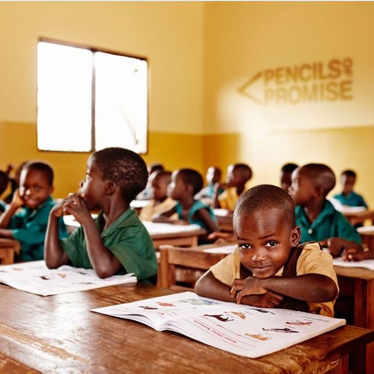

# Centre For Communities Education and Youth Development (CCEYD)

## About CCEYD

**Centre For Communities Education and Youth Development (CCEYD)** is a premier Non-Governmental Organization (NGO) based in Tamale, Northern Region, Ghana. Since 2012, CCEYD has been dedicated to grassroots empowerment, sustainable development, and transformative social change across West Africa.

Our vision is a future where communities are empowered to drive positive change through localized leadership, education, and advocacy. We are proud to be at the forefront of youth empowerment, education, and good governance in Ghana.

## Core Focus Areas

Our programs address the most pressing challenges facing communities in the Northern Region and beyond:
1. **Good Governance:** Advocating for transparency, civic participation, and accountability.
2. **Environmental Sustainability:** Protecting natural resources and promoting resilient community practices.
3. **Health Education:** Providing essential WASH training, medical care access, and sanitation awareness.
4. **Inclusive Education:** Ensuring quality education and breaking barriers for vulnerable children.
5. **Human Trafficking Prevention:** Raising awareness and establishing community-led protection networks.
6. **Child Rights Advocacy:** Championing the rights framework to protect the dignity and safety of all children.

## Our Leadership Team

The driving force behind CCEYD's mission:
* **Mr. Ibrahim Abu** - Executive Director (Leading vision and community transformation since 2012)
* **Mr. Alhassan** - Programs Manager (Expertise in environmental sustainability and resilience)
* **Mr. Huzaifa Issahaku** - Programs Coordinator and Team Lead (Advancing health and wellness in Northern Ghana)
* **Miss Sulemana Reihana** - Project Coordinator and Project Lead (Creating nurturing and protective environments for children)

## Get Involved

We believe in the power of collective action. Whether you are locally based in Tamale or an international advocate:
* **[Donate](donate.html):** Your contribution directly funds grassroots projects.
* **[Volunteer](volunteer.html):** Join our network of passionate changemakers.
* **[Partner With Us](partner.html):** Collaborate on scalable solutions for systemic impact.

## Contact Information

* **Location:** Tamale, Northern Region, Ghana, West Africa
* **Phone:** +233 24 262 5055
* **Email:** contact@cceyd.org
* **Website:** [cceyd.org](https://cceyd.org)

---

*CCEYD - Empowering communities worldwide for positive change. Advocating for good governance, education, and human rights.*
